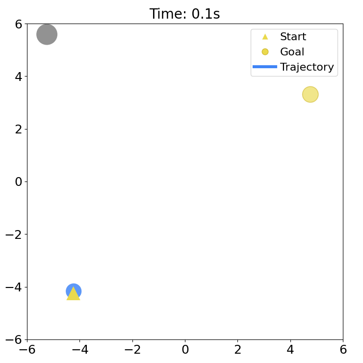

# Reinforcement Learning Adaptive CVaR Barrier Function

Code for **[Reinforcement Learning for Risk Adaptation via Differentiable CVaR Barrier Functions](https://arxiv.org/abs/2605.21257)**.



The project trains PPO policies for crowd navigation with differentiable CVaR-CBF-QP safety layers.

## Install

Clone the repository and create the environment:

```bash
git clone https://github.com/anonymousrobotics9666/Reinforcement-Learning-Adaptive-CVaR-Barrier-Function.git
cd Reinforcement-Learning-Adaptive-CVaR-Barrier-Function
conda env create -f environment.yml
conda activate rl-cvar-cbf
```

For a specific CUDA build, install the matching PyTorch wheel for your machine after activating the environment. The code uses PyTorch directly; `Python-RVO2` is not required.

## Quick Start

Run the smoke test first. It checks config loading, environment stepping, model construction, checkpoint reload, and one short eval rollout.

```bash
python test/smoke_test.py
```

Expected ending:

```text
smoke test passed: test/smoke/<timestamp>/smoke_result.json
```

## Train

Default DiffCVaR-CBF-QP training:

```bash
bash scripts/run_ppo.sh
```

Useful short debug run:

```bash
WANDB_MODE=offline RUN_NAME=debug bash scripts/run_ppo.sh \
  trainer.total_timesteps=100000 \
  trainer.num_envs=4 \
  trainer.eval_interval=1
```

Train the vanilla PPO baseline:

```bash
MODEL=ppo_base RUN_NAME=ppo_base bash scripts/run_ppo.sh
```

Outputs are saved under:

```text
outputs/social_nav_var_num/runs/<run_name>-<model>-bs<batch>-ep<epochs>-lr<lr>/
```

Each run contains `config.yaml`, `ckpt_<step>.pt`, and `ckpt_manifest.json`.

## Paper-Style Demo

Example command for a slower unicycle robot with TurtleBot4-like speed, human speeds in `[0.2, 0.35]`, 15 humans, safety margin `0.2`, and longer episodes:

```bash
WANDB_MODE=offline RUN_NAME=turtlebot4_demo bash scripts/run_ppo.sh \
  model=diff_cvar \
  robot=unicycle \
  robot.vmax=0.35 \
  robot.omega_max=1.5 \
  env.humans.vmax='[0.2,0.35]' \
  env.humans.num_humans=15 \
  env.controller.safety_margin=0.2 \
  env.max_steps=1200 \
  trainer.total_timesteps=20000000
```

## Evaluate

List checkpoints:

```bash
ls outputs/social_nav_var_num/runs
ls outputs/social_nav_var_num/runs/<run>/ckpt_*.pt
```

Evaluate one checkpoint:

```bash
python scripts/eval.py \
  --save-dir outputs/social_nav_var_num/runs/<run> \
  --checkpoint outputs/social_nav_var_num/runs/<run>/ckpt_<step>.pt
```

Save rollout GIFs:

```bash
python scripts/eval.py \
  --save-dir outputs/social_nav_var_num/runs/<run> \
  --checkpoint outputs/social_nav_var_num/runs/<run>/ckpt_<step>.pt \
  --visualize
```

## W&B Logging

Offline logging:

```bash
WANDB_MODE=offline bash scripts/run_ppo.sh
```

Online logging:

```bash
wandb login
WANDB_ENTITY=<your_user_or_team> WANDB_PROJECT=<your_project> bash scripts/run_ppo.sh
```

## Repository Layout

```text
config/      Hydra configs
crowd_sim/   Gymnasium crowd navigation environments
model/       PPO and DiffCVaR-CBF-QP models
trainer/     PPO training loop and checkpointing
scripts/     Train and eval entrypoints
test/        Smoke tests
```
