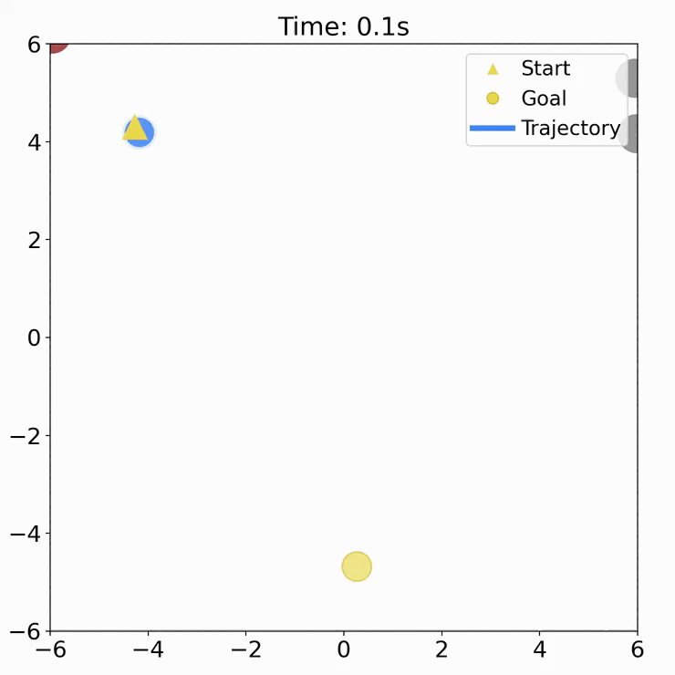
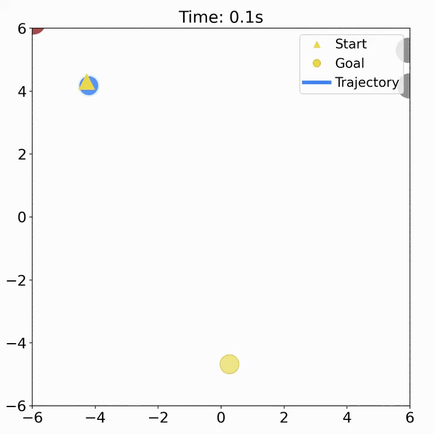
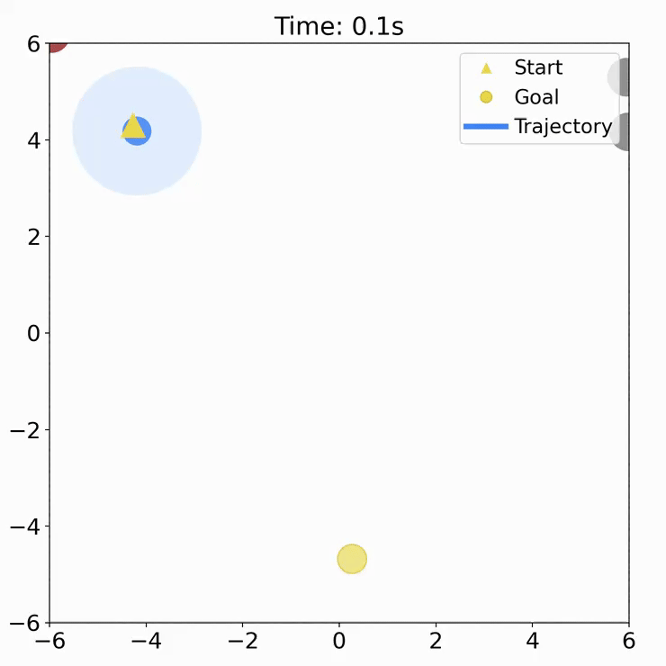

# Reinforcement Learning Adaptive CVaR Barrier Function

Crowd navigation scneario

High-density out-of-distribution comparison (2× speed). 


|  |  |  |  |
| -------------- | ------------------------------ | ---------------------- | ------------------ |
| RL — collision | RL + Safety Filter — collision | CVaR-BF-QP — collision | **Ours — success** |


## Install

Clone the repository and create the environment:

```bash
git clone https://github.com/anonymousrobotics9666/Reinforcement-Learning-Adaptive-CVaR-Barrier-Function.git
cd Reinforcement-Learning-Adaptive-CVaR-Barrier-Function
conda env create -f environment.yml
conda activate rl-cvar-cbf
```

For a CUDA build, install the matching PyTorch wheel for your machine after activating the environment. 

## Quick Start

Run a short environment rollout to verify the install and save a GIF:

```bash
python scripts/test_env.py
```

Expected ending:

```text
env test passed: outputs/social_nav_var_num/env_test/<run>/summary.json
```

## Train

Default DiffCVaR-CBF-QP training:

```bash
bash scripts/run_ppo.sh
```

Train the vanilla PPO baseline:

```bash
MODEL=ppo_base RUN_NAME=ppo_base bash scripts/run_ppo.sh
```

Outputs are saved under:

```text
outputs/social_nav_var_num/runs/<run_name>-<model>-bs<batch>-ep<epochs>-lr<lr>/
```

Each run contains `config.yaml`, `ckpt_<step>.pt`, and `ckpt_manifest.json`.

## Common Overrides

Common options can be changed from the shell launcher:


| Option           | Values / example                              |
| ---------------- | --------------------------------------------- |
| Model            | `MODEL=diff_cvar` or `MODEL=ppo_base`         |
| Robot            | `ROBOT=single_integrator` or `ROBOT=unicycle` |
| Number of humans | `env.humans.num_humans=15`                    |


Example:

```bash
MODEL=diff_cvar ROBOT=single_integrator RUN_NAME=demo bash scripts/run_ppo.sh \
  env.humans.num_humans=15
```

For all other parameters, see the YAML files under `config/`.

## W&B Logging

For offline logging:

```bash
WANDB_MODE=offline bash scripts/run_ppo.sh
```

For online logging:  

```bash
wandb login
WANDB_PROJECT=<project_name> WANDB_ENTITY=<user_or_team> bash scripts/run_ppo.sh
```

## Evaluate

List checkpoints:

```bash
ls outputs/social_nav_var_num/runs
ls outputs/social_nav_var_num/runs/<run>/ckpt_*.pt
```

Evaluate one checkpoint:

```bash
python scripts/eval.py \
  --save-dir outputs/social_nav_var_num/runs/<run> \
  --checkpoint outputs/social_nav_var_num/runs/<run>/ckpt_<step>.pt
```

Save rollout GIFs:

```bash
python scripts/eval.py \
  --save-dir outputs/social_nav_var_num/runs/<run> \
  --checkpoint outputs/social_nav_var_num/runs/<run>/ckpt_<step>.pt \
  --visualize
```

## Repository Layout

```text
config/      Hydra configs
crowd_sim/   Gymnasium crowd navigation environments
model/       PPO and DiffCVaR-CBF-QP models
trainer/     PPO training loop and checkpointing
scripts/     Train, eval, and environment test entrypoints
```

## Acknowledgments

Thank the authors of [CrowdNav_Prediction_AttnGraph](https://github.com/Shuijing725/CrowdNav_Prediction_AttnGraph) for the crowd navigation environment and baseline references, and [PPO-for-Beginners](https://github.com/ericyangyu/PPO-for-Beginners) for the clear PPO baseline implementation.
